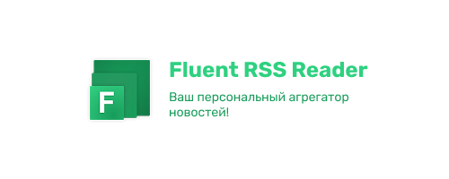

# 🌟 Fluent RSS Reader

**The #1 RSS Reader with Multilingual Support and Liquid Glass Design**

A modern, responsive RSS reader that supports English and Slavic languages with a beautiful liquid glass aesthetic. Built as a Progressive Web App (PWA) for seamless cross-platform experience.

## ✨ Features

### 🌍 Multilingual Support
- **7 Languages**: Russian, English, Ukrainian, Polish, Czech, Bulgarian, Serbian
- **Smart Language Detection**: Automatically detects user's preferred language
- **Real-time Language Switching**: Change language without page reload

### 🎨 Liquid Glass Design
- **Modern Glassmorphism**: Beautiful frosted glass effects with backdrop blur
- **Adaptive Themes**: Light, dark, and system-based theme switching
- **Smooth Animations**: Fluid transitions and micro-interactions
- **Responsive Layout**: Perfect on desktop, tablet, and mobile devices

### 📱 Progressive Web App
- **Offline Support**: Read cached articles without internet
- **Install Anywhere**: Works on any device with a modern browser
- **Push Notifications**: Get notified about new articles (coming soon)
- **Fast Loading**: Optimized performance with service worker caching

### 🔍 Advanced Features
- **Smart Search**: Search across all articles in real-time
- **Category Management**: Organize feeds by custom categories
- **Feed Management**: Easy add, edit, delete, and share feeds
- **Multiple View Modes**: Normal article view and embedded web page view
- **Social Sharing**: Share articles across multiple platforms
- **Feed Sharing**: Share feed subscriptions with friends

### 📊 Feed Support
- **RSS 2.0**: Full support for RSS feeds
- **Atom**: Compatible with Atom feeds
- **Media Content**: Display images and videos from feeds
- **Rich Content**: Support for full article content and descriptions
- **Date Sorting**: Articles sorted by publication date

## 🚀 Getting Started

### Quick Start
1. Open the application in your browser
2. Select your preferred language from the dropdown
3. Add your first RSS feed URL
4. Start reading!

### Adding Feeds
1. Paste any RSS feed URL into the input field
2. Select a category (optional)
3. Click "Add" to subscribe
4. The feed will appear in your tabs

### Managing Categories
1. Click "Add Category" to create custom categories
2. Organize your feeds by topic, source, or preference
3. Filter feeds by category using the dropdown

## 🛠️ Technical Details

### Built With
- **Vanilla JavaScript**: No frameworks, pure performance
- **Modern CSS**: CSS Grid, Flexbox, CSS Variables
- **Service Worker**: Offline functionality and caching
- **Web APIs**: Fetch, LocalStorage, Clipboard, Notifications

### Browser Support
- Chrome/Edge 80+
- Firefox 75+
- Safari 13+
- Mobile browsers with PWA support

### Performance
- **Lazy Loading**: Images and videos load on demand
- **Efficient Caching**: Smart caching strategy for optimal performance
- **Minimal Bundle**: Lightweight codebase for fast loading
- **Responsive Images**: Optimized media loading

## 🎯 Use Cases

### Personal News Reading
- Subscribe to your favorite news sources
- Organize feeds by topics (Tech, Sports, Politics, etc.)
- Read articles in your preferred language

### Professional Monitoring
- Track industry news and updates
- Monitor competitor blogs and announcements
- Stay updated with technology trends

### Content Curation
- Collect articles from multiple sources
- Share interesting feeds with colleagues
- Build a personal knowledge base

### Multilingual Content
- Read content in multiple Slavic languages
- Perfect for language learning
- Support for international news sources

## 🔧 Advanced Configuration

### Custom Categories
Create categories that match your interests:
- Technology & Programming
- Business & Finance
- Health & Lifestyle
- Entertainment & Media
- Science & Research

### Feed Organization
- Rename feeds for better identification
- Move feeds between categories
- Delete unused subscriptions
- Share feed URLs with others

### Theme Customization
- **Light Theme**: Perfect for daytime reading
- **Dark Theme**: Easy on the eyes for night reading
- **System Theme**: Automatically matches your device settings

## 🌐 Supported Languages

| Language | Code | Native Name |
|----------|------|-------------|
| Russian | ru | Русский |
| English | en | English |
| Ukrainian | uk | Українська |
| Polish | pl | Polski |
| Czech | cs | Čeština |
| Bulgarian | bg | Български |
| Serbian | sr | Srpski |

## 📱 Installation

### As PWA
1. Open the app in your browser
2. Look for the "Install App" button in the bottom navigation
3. Click to install as a native app
4. Access from your home screen or app drawer

### Browser Bookmark
- Bookmark the page for quick access
- Pin the tab for persistent availability
- Use browser's "Add to Home Screen" feature

## 🔒 Privacy & Security

- **No Data Collection**: All data stays on your device
- **Local Storage**: Feeds and preferences stored locally
- **No Tracking**: No analytics or user tracking
- **Secure Connections**: All external requests use HTTPS
- **Content Filtering**: Safe content loading with sandboxed iframes

## 🚀 Future Enhancements

### Planned Features
- **Push Notifications**: Real-time article notifications
- **Offline Reading**: Enhanced offline article storage
- **Export/Import**: Backup and restore feed subscriptions
- **Advanced Filters**: Filter articles by keywords, date, source
- **Reading Statistics**: Track reading habits and preferences
- **Social Features**: Share and discover feeds from community

### Technical Improvements
- **Performance Optimization**: Even faster loading times
- **Accessibility**: Enhanced screen reader support
- **More Languages**: Additional language support
- **Advanced Search**: Full-text search with filters
- **API Integration**: Support for popular RSS services

## 🤝 Contributing

We welcome contributions! Here's how you can help:

### Language Translations
- Add support for new languages
- Improve existing translations
- Fix translation errors

### Bug Reports
- Report issues on GitHub
- Provide detailed reproduction steps
- Include browser and device information

### Feature Requests
- Suggest new features
- Provide use case examples
- Help prioritize development

## 📄 License

This project is open source and available under the MIT License.

## 🙏 Acknowledgments

- **RSS Community**: For maintaining the RSS standard
- **Open Source Contributors**: For inspiration and code examples
- **Beta Testers**: For feedback and bug reports
- **Translation Contributors**: For multilingual support

---

**Made with ❤️ for the RSS community**

*Fluent RSS Reader - Your gateway to organized, multilingual news consumption*

## 📞 Contact

- **Developer**: SerGio Play Dev
- **Website**: [sergioplay-dev.netlify.app](https://sergioplay-dev.vercel.app/)
- **Version**: 2.0.0
- **Year**: 2025

---

### 🌟 Star this project if you find it useful!
